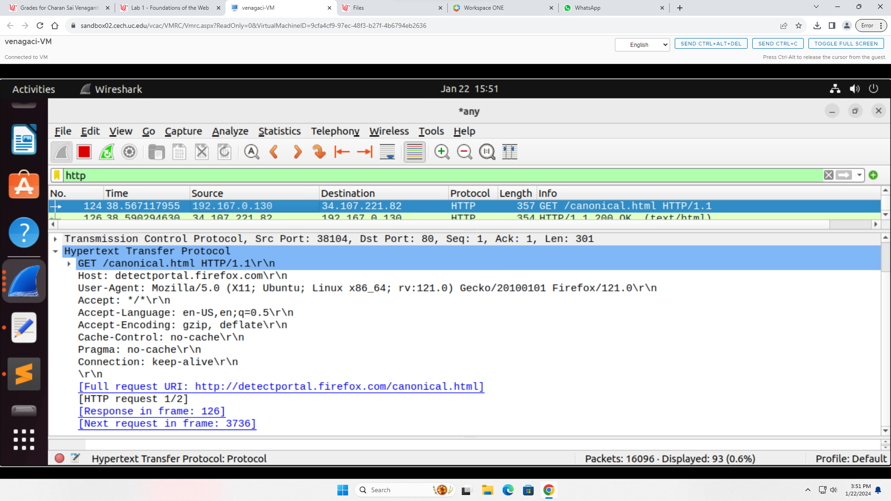

# WAPH-Web Application Programming and Hacking
## Instructor name: Dr.Phu Phung

## Student info: 
 
**Name**: Charan Sai Venaganti

**Email**: venagaci@mail.uc.edu


## Repository information

Repository's URL: [https://github.com/venagaci/waph-venagaci]

###   Task 1. 
#### Summarize how you developed a Hello World CGI program in C and compiled and deployed the program on the web server.  **(2.5 pts)**. Demonstrate the task with a screenshot showing the CGI program is invoked properly in a browser. **(2.5 pts)**

#### Solution:
I used a network packet analyzer called Wireshark which tried to capture network packets and tried to display that packet data as detailed as possible.
1. I have installed wireshark using $sudo apt install wireshark-qt.
2. After installation , I ran the application using $sudo wireshark & and I entered a command called $ telnet example 80 and made a request from my mozilla firefox.
3. After opening netwrok analyser window I have clicked on any which includes all interfaces to start capturing packet. And then Clicked start to start capturing.
4. After filtering out by typing http in search bar I got request and response messages and given below.

 

### Caption: Examining the HTTP Request
 


### Caption:  Examining the HTTP Response 


### Caption: Here is the Overall HTTP Stream 

 

### Task 2.

#### Summarize how you used the telnet program to send a minimal HTTP Request and the Wireshark tool to examine the HTTP messages

#### Solution: 
1. I used a network application called telnet protocol. This telnet protocol that can be used to make a TCP
connection to a server to send and receive data to/from the server.In this task I done similar experiments as in Task 1, where I retrieved the webpage at http://example.com/index.html. However, instead of using a web browser, I used the telnet program to construct a valid HTTP Request to send to the web server.

2. I Started up the Wireshark packet sniffer and filtered only “http” in the search bar and began the packet capture as in Task 1. Then I opened the terminal to connect to the webserver at port 80 by typing $ telnet example.com 80. But here I used Http/1.0
   
3. Then I saw the data response from the server (HTTP Response). and I Stoped Wireshark packets capture and examined the HTTP Request and Response messages and compared with similar ones in Task 1.
 

#### A screenshot of your terminal showing the HTTP Request (you typed) and HTTP response from the server.

.png)

### Caption: Here is the screenshot of the terminal showing the HTTP request I typed

Response.png)

### Caption: Here is the screenshot of the wireshark showing the HTTP response. 


#### A screenshot of the HTTP Request message (you typed in telnet above) in Wireshark as in Task 1. Is there any difference between this HTTP Request message and the one the browser sent in Task 1? Hints: What fields are missing in this request compared to the one the browser sent?

Request.png)

### Caption: Here is the screenshot of the request in the wireshark.


Yes there are several differences:
The second HTTP request lacks key headers such as User-Agent, Accept, Accept-Language, Accept-Encoding, Cache-Control, Pragma, and Connection, and it uses a different HTTP version (HTTP/1.0) compared to the first request.

#### A screenshot of the HTTP Response message in Wireshark that the server responded to your request. Is there any difference between this HTTP Response message and the one in Task 1? 

Response.png)

### Caption: Here is the screenshot of the response in the wireshark.


There are more differences in the response message when compared to task 1 they are:The HTTP responses in Task 1 and Task 2 differ in several aspects. Notably, the HTTP versions are distinct, with Task 1 using HTTP/1.1 and Task 2 using HTTP/1.0. The server headers differ, with Task 1 showing "Server: nginx" and Task 2 indicating "Server: ECS (cha/8094)." Cache-Control directives vary, as Task 1 includes "public, must-revalidate, max-age=0, s-maxage=3600," while Task 2 specifies "max-age=604800." Content-Type headers also differ, with Task 1 having "Content-Type: text/html" and Task 2 presenting Additionally, the Date, Etag, Expires, Last-Modified, X-Cache, and Content-Length headers exhibit disparities between the two responses. Task 2 uniquely includes Etag, Expires, Last-Modified, and X-Cache headers, while Task 1 lacks these. Content-Length values also differ, with Task 1 having a length of 90 and Task 2 with 1256.


## Part II - Basic Web Application Programming

###   Task 1. (10 pts) CGI Web applications in C

#### a. Summarize how you developed a Hello World CGI program in C and compiled and deployed the program on the web server.Demonstrate the task with a screenshot showing the CGI program is invoked properly in a browser.

Solution:
1. At first I installed gcc compiler using $ sudo apt install gcc and ran it as a regular binary program.
2. Then I typed $ subl helloworld.c to open sublime text editor.After opening I have entered the C program code of helloworld and saved it.
3. After saving I went to terminal and compiled using the command $ gcc helloworld.c -o helloworld.cgi and ran the program using $ ./helloworld.cgi
4. Before that, In order to enable the apache webserver I typed $ sudo a2enmod cgid .Then restarted the Apache Server using 
$ sudo systemctl restart apache2.
5. CGI programs are stored in /usr/lib/cgibin folder will be invoked by Apache2 when requested. So I needed to copy any CGI programs into this folder using command $ sudo cp helloworld.cgi /usr/lib/cgi-bin.
6. I went to browser and typed http://localhost/cgi-bin/helloworld.cgi


.png)

### Caption: Here is the screenshot showing the output of the CGI program helloworld.c in the browser

 
b. Summarize and demonstrate with a screenshot that you can write another C CGI program and deploy it with a simple HTML template provided on https://www.w3schools.com/html/Links to an external site. with proper title, heading, and paragraph, i.e., the course and your information should be there. Include the source code of the file in the report. An example of code inclusion is below.


1. Here Then I typed $ subl index.c to open sublime text editor.After opening I have entered the C program code of HTML and saved it.
2. After saving I went to terminal and compiled using the command $ gcc index.c -o index.cgi and ran the program using $ ./index.cgi
3. CGI programs are stored in /usr/lib/cgibin folder will be invoked by Apache2 when requested. So I needed to copy any CGI programs into this folder using command $ sudo cp index.cgi /usr/lib/cgi-bin.
4. I went to browser and typed http://localhost/cgi-bin/index.cgi

Here is the index.c program I have used.
### index.c

 Included file `helloworld.c`:
   ```C
      #include <stdio.h>
      int main() {
         
          printf("<!DOCTYPE html>");
          printf("<html>");
          printf("<head>");
          printf("<title>Topic in Computer Systems</title>");
          printf("</head>");
          printf("<body>");
          printf("<h1>My name is Charan Sai Venaganti</h1>");
          printf("<p>I am pursuing my masters in information technology.</p>");
          printf("</body>");
          printf("</html>");

          return 0;
     }
 ```

   
      
indexcterminalss.png)

### Caption: Screenshot of my terminal showing the compilation of the CGI index.c program and execution.


indexcbrowserSS.png)

### Caption: Screenshot of my browser showing the output of the index.c program


###  Task 2 (10 pts). A simple PHP Web Application with user input.

a. Summarize and demonstrate with a screenshot that you have successfully developed a simple `helloworld.php` PHP page with your name and PHP configuration as guided in Lecture 3. 

1. I have installed PHP and configured it to work with Apache Web Server, use the following command in a terminal $ sudo apt-get install php libapache2-mod-php -y–
2. After that I created a new file name helloworld.php in folder labs/lab1 in my private repository with the similar content provided by the professor.
3. The I deployed the code to the webserver $ sudo cp helloworld.php /var/www/html
4. Then I went to browser and typed http://localhost/helloworld.php


helloworldphpbrowserSS.png)

### Caption: Screenshot that shows I successfully developed a simple helloworld.php PHP page with my name and PHP configuration


#### b. Demonstrate that you developed and deployed an echo Web application in PHP, e.g., `echo.php` with a screenshot with your name in the data. Include the source code of the file in the report and discuss if there are any security risks in this simple web application.


1. I created a echo.php file and written the php code given by the professor
2. I Deployed the code to the webserver Root directory $ sudo cp echo.php /var/www/html
3. Here is the code of PHP I used:

echo.php
<?php
echo $_REQUEST["data"];
?>

4. Then I went to the browser the page with input data in the URL
http://localhost/echo.php?data=Charan Sai Venaganti

echophpbrowsrSS.png)

### Caption: Here is the screenshot of my browser showing the output of echo.php with my name.


#### Yes there are risks in this process:
Using $_REQUEST[] in PHP to retrieve input is considered potentially dangerous due to security vulnerabilities. This superglobal combines data from $_GET, $_POST, and $_COOKIE, making it challenging to discern the source of the data and increasing the risk of unintended overwriting. The inclusion of cookie data exposes the application to potential attacks, and the ambiguity of data sources can be exploited by malicious actors. Security best practices recommend using $_GET for read-only requests and $_POST for modifying data, while using $_REQUEST undermines this distinction. Additionally, it can increase the risk of injection attacks if the data is utilized in security-sensitive operations. Therefore, it is advisable to explicitly use $_GET or $_POST based on the nature of the request and implement proper input validation and sanitation to enhance security.

### Task 3 (10 pts). Understanding HTTP GET and POST requests.

#### a. Briefly describe how you used Wireshark to examine the HTTP GET Request and Response for the `echo.php` page with your name in the data. Demonstrate with two corresponding screenshots in Wireshark.

1. I used a network packet analyzer called Wireshark which tried to capture network packets and tried to display that packet data as detailed as possible.
2. I have typed URL: http://localhost/echo.php?data=Charan Sai Venaganti in the browser but before clickeing on enter I started wireshark to capture the request and response.
3. Here I clicked enter on the browser to start the process.
4. I went to wireshark and filtered out http requests and responses with echo.php name.Upon right clicking on request and response I can see the code of it.


Request.png)

### Caption: Screenshot of the request I made in the wireshark with my name

Response.png)

### Caption : Screenshot of the response I made in the wireshark with my name.


#### b. Summarize using `curl` to create an HTTP POST request with your name in the data. Demonstrate the outcome with a screenshot from the `curl` program **(2.5 pts)**, and a screenshot of the corresponding HTTP Stream in Wireshark. **(2.5 pts)**

1. Before using the curl , I installed curl using $ sudo apt-get install curl.After installing
2. I typed the request with input from a terminal $ curl -X POST http://localhost/echo.php -d "data=Hello world, Charan Sai Venaganti"


POSTCURLBROWSERRESPONSESS.png)

### Caption: Screenshot of my browser showing the output using CURL with my name.


POSTCURLREQUESTOFWIRESHARK.png)

### Caption: Screenshot of the request I made in the wireshark.


CURLHTTPSTREAMOFWIRESHARK.png)

### Caption: Screenshot of the HTTP Stream in the wireshark

#### c. Compare the similarity/difference between HTTP POST Request and HTTP GET Request and between the two HTTP Responses above. **(2.5 pts)**    

If we use GET request the response will be clearly seen in the URL .Hence it is easy for the attackers to attack.Whereas if we use POST request , the response will be hidden .Hence there are less chances of getting attacked by the hackers.
